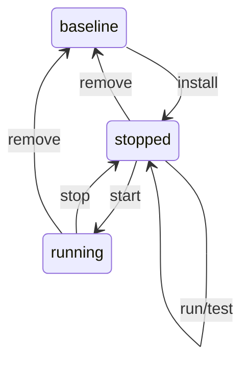

# Example app using ACAP and Rust

> [!IMPORTANT]
> This project is an experiment provided "as is".
> While we strive to maintain it, there's no guarantee of ongoing support, and it may become unmaintained in the future.
> Your contributions are appreciated, and feel free to fork and continue the journey if needed.

This is a template that can be used to create a new app using [Axis Camera Application Platform (ACAP)](https://axiscommunications.github.io/acap-documentation/) and Rust.
To contribute to the crates that this template uses, please see [acap-rs](https://github.com/AxisCommunications/acap-rs).

## Quickstart guide

The quickest way to build this example is to launch the dev container and run `cargo-acap-build`.
Once it completes there should be two `.eap` files in `target/acap`:

```console
$ ls -1 target/acap
hello_world_0_1_0_aarch64.eap
hello_world_0_1_0_armv7hf.eap
```

If you have a device that you would like to run the app on, the recommended workflow is:

```shell
# Specify which device to target and how to authenticate
export AXIS_DEVICE_IP=<AXIS_DEVICE_IP>
export AXIS_DEVICE_USER=<AXIS_DEVICE_USER>
export AXIS_DEVICE_PASS=<AXIS_DEVICE_PASS>

# Restore the device to a known state
RUST_LOG=info device-manager reinit

# Build the app and install on the device
cargo-acap-sdk install

# Build the app, patch the previously installed app on the device, and run with stdout attached
cargo-acap-sdk run
```

Other useful workflows are documented under the "Verbs" section of the [Makefile](./Makefile).
If Rust crate `mkhelp==0.2.3` is installed, they can be summarized like:

```console
$ mkhelp Makefile
Checks:
    check_all: Run all other checks
  check_build: Check that all crates can be built
   check_docs: Check that docs can be built
 check_format: Check that the code is formatted correctly
   check_lint: Check that the code is free of lints

Fixes:
 fix_format: Attempt to fix formatting automatically
   fix_lint: Attempt to fix lints automatically
```

## Programs

The dev-container includes a few tools in addition to those that come with the ACAP Native SDK.
The help texts from each are documented below along with some additional notes.

### Porcelain

These programs have an ergonomic interface and should fit most users most of the time.

```console
$ cargo-acap-sdk
Tools for developing ACAP apps using Rust

Usage: cargo-acap-sdk <COMMAND>

Commands:
  build        Build app(s) with release profile
  run          Build app(s) and run on the device
  test         Build app(s) in test mode and run on the device
  install      Build app(s) with release profile and install on the device
  start        Start app on device
  stop         Stop app on device
  restart      Restart app on device
  remove       Remove app form device
  completions  Print shell completion script for this program
  help         Print this message or the help of the given subcommand(s)
```

Note that some commands must be run before other as illustrated by this state diagram:



Note that the shell completions may not work when using the program as a cargo plugin like
`cargo acap-sdk` (note the difference between ` ` and `-`).

### Plumbing

These programs have a flexible interface making them handy when the porcelain is too rigid.

```console
$ acap-ssh-utils
Utilities for interacting with Axis devices over SSH.

Usage: acap-ssh-utils --host <HOST> --user <USER> --pass <PASS> <COMMAND>

Commands:
  patch      Patch app on device
  run-app    Run app on device, sending output to the terminal
  run-other  Run any executable on device, sending output to the terminal
  help       Print this message or the help of the given subcommand(s)

Options:
      --host <HOST>  Hostname or IP address of the device [env: AXIS_DEVICE_IP=]
  -u, --user <USER>  The username to use for the ssh connection [env: AXIS_DEVICE_USER=]
  -p, --pass <PASS>  The password to use for the ssh connection [env: AXIS_DEVICE_PASS=]
```

```console
$ cargo-acap-build -h
ACAP analog to `cargo build`

Usage: cargo-acap-build [OPTIONS] [ARGS]...

Arguments:
  [ARGS]...  Pass additional arguments to `cargo build`

Options:
      --target <TARGET>  If given, build only for the given architecture(s) [possible values: aarch64, armv7hf]
```

```console
$ device-manager
Utilities for managing individual devices.

Usage: device-manager --host <HOST> --user <USER> --pass <PASS> <COMMAND>

Commands:
  restore  Restore device to a clean state
  reinit   Restore and initialize device to a known, useful state
  help     Print this message or the help of the given subcommand(s)

Options:
      --host <HOST>  Hostname or IP address of the device [env: AXIS_DEVICE_IP=]
  -u, --user <USER>  The username to use for the ssh connection [env: AXIS_DEVICE_USER=]
  -p, --pass <PASS>  The password to use for the ssh connection [env: AXIS_DEVICE_PASS=]
```

## License

[MIT](LICENSE)
